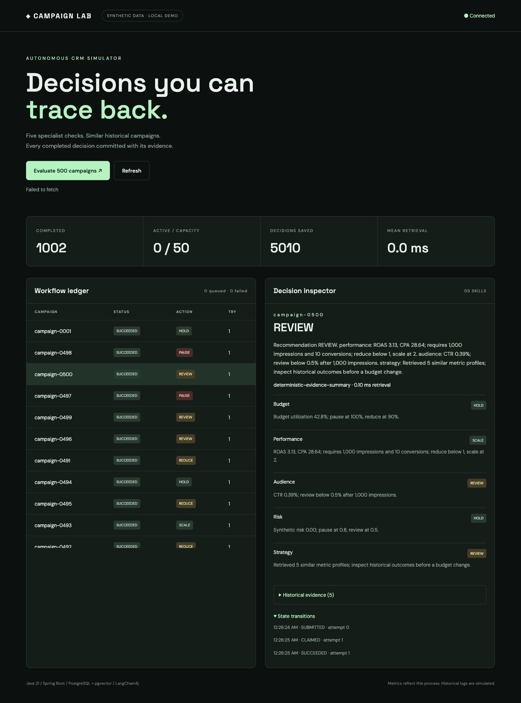

# Autonomous CRM Simulator

A campaign evaluation lab with five policy skills, evidence retrieval, a durable workflow queue, and an inspectable decision dashboard. Built with Java 21, Spring Boot, PostgreSQL/pgvector, and optional LangChain4j explanations.

**All campaigns and historical logs are synthetic.** Benchmark results describe measured runs. The default skills are deterministic policies. An optional LLM explains their decisions and does not control the final action.

## Run

### PostgreSQL + pgvector (recommended)

Install Docker with Compose, then:

```sh
docker compose up --build
# Open http://localhost:8080
```

This starts a persistent PostgreSQL volume, seeds **500 campaigns** and **10,000 historical logs**, and enables up to **50 worker tasks per instance**. First startup may take several minutes to build/download images. No API key needed.

```sh
python3 scripts/smoke.py --expect-mode postgres-pgvector-hnsw
python3 scripts/benchmark.py --output benchmark.json
python3 scripts/recovery.py
```

The recovery script kills and restarts the demo app. Run against your local demo only. `docker compose down` preserves data. `docker compose down -v` deletes it.

### Standalone demo (no Docker)

Install JDK 21, then use the included Maven wrapper:

```sh
./mvnw verify
./mvnw spring-boot:run
# Open http://localhost:8080
python3 scripts/smoke.py --expect-mode demo-exact-cosine
python3 scripts/recovery-local.py
```

The standalone mode uses a persistent H2 database at `data/crm` with delayed writes disabled (`WRITE_DELAY=0`) and an in-memory exact vector index. It is useful for inspecting behavior; it does not validate PostgreSQL or HNSW performance. Stop the app before removing `data/` to reset it. Use Docker for multiple app instances.

## What happens in a workflow

1. Submit a campaign ID and an idempotency key. The database durably queues the workflow.
2. A worker atomically claims it with an owner, attempt number, and renewable lease.
3. Retrieve five nearest historical metric profiles.
4. Evaluate budget, performance, audience, risk, and strategy skills.
5. Resolve constraints in order: **PAUSE > REDUCE > REVIEW > SCALE > HOLD**. Strategy contributes context, not a veto.
6. Generate an evidence-based explanation, optionally using LangChain4j.
7. Commit all five decisions, their evidence IDs, the result, and the success event in one transaction.

A worker whose lease expired or whose attempt was superseded cannot commit. Expired work can be replayed, up to three attempts. This is **at-least-once computation with one fenced, atomic database result**, not exactly-once LLM calls or a guarantee against database/volume loss.

## Dashboard



Click **Evaluate 500 campaigns** to queue a batch, then select a row to inspect each skill's reasoning, retrieved logs, and workflow events. Metrics reflect the current process; durable workflow and decision counts come from the database.

## APIs

| Endpoint | Purpose |
| --- | --- |
| `GET /api/campaigns?limit=500` | List seeded or user-created campaigns |
| `POST /api/campaigns` | Create validated synthetic metrics |
| `GET /api/campaigns/{id}/evidence` | Inspect the five retrieved logs |
| `POST /api/workflows` | Queue one idempotent workflow |
| `POST /api/workflows/batch` | Queue 1–500 campaigns, using runKey + campaign ID for idempotency |
| `GET /api/workflows/{id}` | Poll durable status and result |
| `GET /api/workflows/{id}/events` | Inspect lifecycle events |
| `GET /api/stats` | Workflow counts, worker capacity, retrieval measurements |
| `POST /mcp` | Minimal stateless Streamable HTTP MCP tools |
| `GET /actuator/health` | Process/database health |

```sh
curl -s http://localhost:8080/api/workflows \
  -H 'Content-Type: application/json' \
  -d '{"campaignId":"campaign-0001","idempotencyKey":"demo-1"}'
```

Reusing the key for the same campaign returns the same workflow. Reusing it for another campaign returns HTTP 409. Campaigns are immutable after creation, so replay does not read changed campaign inputs.

## MCP tools

The server exposes the five skills plus `evaluate_campaign` and `get_workflow`. Each skill tool returns a policy decision with retrieved evidence. `evaluate_campaign` queues the orchestrator, which calls the shared skill registry inside this process. The orchestrator does not make loopback MCP calls; an external MCP client can call the same tools through the transport.

```sh
curl -s http://localhost:8080/mcp -H 'Content-Type: application/json' \
  -d '{"jsonrpc":"2.0","id":1,"method":"initialize","params":{"protocolVersion":"2025-03-26","capabilities":{},"clientInfo":{"name":"demo","version":"1"}}}'
curl -s http://localhost:8080/mcp -H 'Content-Type: application/json' \
  -d '{"jsonrpc":"2.0","id":2,"method":"tools/list"}'
curl -s http://localhost:8080/mcp -H 'Content-Type: application/json' \
  -d '{"jsonrpc":"2.0","id":3,"method":"tools/call","params":{"name":"evaluate_campaign","arguments":{"campaignId":"campaign-0001","idempotencyKey":"mcp-demo-1"}}}'
```

This intentionally small transport supports JSON responses, initialize, ping, tool discovery/calls, and notifications. It has no sessions, SSE, resource/prompt APIs, or authentication. Compatibility with a particular MCP client must be tested; it is not a full SDK implementation.

## Retrieval and optional AI

Historical rows carry normalized **16-dimensional hand-engineered numeric vectors** encoding channel, budget utilization, CTR, ROAS, conversion rate, risk, volume, and CPA. PostgreSQL uses cosine distance and an HNSW index. Standalone demo mode searches all vectors exactly.

These are metric-similarity vectors, **not semantic text embeddings**. Historical outcomes are generated rules, not learned results. The retrieved text and IDs ground the explanation; the policy engine uses current metrics. See [architecture](docs/ARCHITECTURE.md) for tradeoffs and [verification](docs/VERIFICATION.md) for what was actually tested.

To enable optional LLM explanations, copy `.env.example` to `.env` and set `OPENAI_API_KEY`, then start Compose. For standalone mode export the variable in your shell. One call per workflow may cost money. Failed calls fall back to the deterministic summary. LLM text is advisory and may still contain errors; the final action remains policy-controlled. No model call was needed for the default demo.

## Measured local run

A 500-workflow standalone run completed with **500 successes, zero failures**, in **2.784 seconds**. Retrieval p95 was **0.401 ms**. The 50-slot pool reached **48 active workflows**. These are H2/exact-cosine results with no LLM calls, not PostgreSQL or production measurements. See [raw benchmark](docs/benchmark-local.json) and [verification record](docs/verification-results.json).

## Tests and CI

`mvn verify` tests policy thresholds, precedence, vector normalization/ranking, duplicate submission races, competing claims, transactional rollback, stale-worker fencing, lease renewal, bounded retries, validation, MCP request handling, and LangChain4j explanation/fallback against a mock API. GitHub Actions additionally builds the Compose stack and runs PostgreSQL smoke/recovery checks.

The CI file is a reproducible check definition. A green hosted CI badge should only be added after a real GitHub run passes.

## Configuration

| Variable | Default | Purpose |
| --- | --- | --- |
| `CRM_WORKERS` | `50` | Per-instance worker slots, 1–50 |
| `CRM_LEASE_SECONDS` | `60` | Claim lease; heartbeat every 5 seconds; minimum 20 |
| `CRM_SEED_CAMPAIGNS` | `500` | Deterministic synthetic campaign seed count |
| `CRM_SEED_HISTORY` | `10000` | Seeded log count on an empty history table |
| `DATABASE_URL` | H2 file URL | JDBC datasource |
| `DATABASE_USER` | `sa` | Database username |
| `DATABASE_PASSWORD` | Empty in H2 | Password; Compose has a local demo default |
| `OPENAI_API_KEY` | Empty | Optional paid LLM explanations |
| `CRM_LLM_MODEL` | `gpt-4o-mini` | Explanation model name |
| `SERVER_ADDRESS` | `127.0.0.1` | Listener; Compose uses container wildcard with loopback host port |
| `PORT` | `8080` | HTTP port |

Designed for a local portfolio lab. Do not expose the unauthenticated API to the internet. Database decisions are recommendations; no real advertising API executes them. Durable accepted work depends on retaining the database. Horizontal workers share the same database; 50 is per instance, not a global cluster limit. Seed the shared database with one instance before starting more instances.

## Explain it in an interview

Start with the actual demo. Walk through an idempotency conflict, show the five decision records, and demonstrate stale-worker fencing in the tests. Explain why numeric similarity was chosen, why retries can repeat LLM calls, and what would be needed for a production version. See [walkthrough](docs/WALKTHROUGH.md).

MIT licensed.
