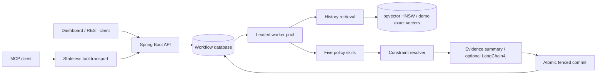

# Architecture and tradeoffs

## Persistence and recovery

Submission commits the workflow and SUBMITTED event together. A unique key makes concurrent duplicate submissions converge on the same identity. A key belongs to exactly one immutable campaign.

Claiming is an atomic compare-and-update: only QUEUED or expired RUNNING rows below the attempt limit can transition to a new owner. Each claim increments an attempt number. Claims are serialized by the database row lock, not an in-memory mutex.

Heartbeat renewals and final writes check owner, attempt, status, and unexpired lease. Completion first conditionally changes the workflow state, then inserts decisions and the success event within the same transaction. A failed insert rolls back the state change and all inserted decisions. A second completion changes zero rows and inserts nothing.

An app crash before commit leaves RUNNING work until the lease expires, then another worker recomputes. A crash after commit leaves SUCCEEDED with the complete five-decision result. A stale worker can continue computing or finish an external LLM request but cannot persist over a new owner. Standalone H2 disables delayed writes (`WRITE_DELAY=0`) so acknowledged commits are flushed immediately instead of waiting for its default asynchronous write interval. A process-kill check covers persistence across an abrupt stop; it is not a physical power-loss test. The database and data volume are the durability boundary; there is no claim that acknowledged writes survive destruction of that boundary.

Events carry database-generated sequence IDs so timestamp ties still have a stable order. They record lifecycle transitions, not every instruction executed by a model. The complete skill decision batch is committed at completion, rather than checkpointed between each skill. Workflow processing is retryable; permanent failures are recorded after three attempts. No side effect modifies real ad spend.

## Why these skills

- Budget: reduce at 90% utilization, pause at 100%.
- Performance: require sufficient observations; scale when ROAS >= 2, reduce below 1.
- Audience: flag CTR below 0.5% after 1,000 impressions.
- Risk: review at 0.5 synthetic risk, pause at 0.8.
- Strategy: cite historical context for human inspection; does not change the final action.

All thresholds are illustrative. This project implements a multi-skill workflow simulator, not independently trained agents or a validated advertising optimization system.

## Retrieval

The normalized numeric features intentionally retrieve campaigns with similar metrics rather than similar prose. Synthetic logs are seeded with Random(42); the outcome text is generated from a simple rule. Cosine similarity is used both locally and in pgvector. HNSW returns approximate nearest neighbors; exact demo results can differ slightly. PostgreSQL stores vectors with 32-bit floats while the demo uses Java doubles.

The H2 demo holds a startup snapshot of history in memory. History is immutable through the public API. PostgreSQL history is indexed at startup. Adding dynamic historical ingestion would require transactional vector updates and cache invalidation.

An LLM, when enabled, receives decisions plus retrieved evidence. It generates an advisory narrative, not the final action. There is no paid model call in the default execution path. Prompt instructions are not a security boundary, which is another reason that generated prose cannot execute actions.

## What to add for production

Authentication and per-user authorization; request throttling; explicit schema migrations; business-calibrated rules; model evaluation against labeled examples; connection and query timeouts; metrics export; database backups; global concurrency limits; model-cost budgets; structured LLM validation; optimistic input versioning; transactional outbox before external ad API writes; and a full MCP SDK for broad client compatibility.

These are future engineering choices, not features claimed by the current repository.
